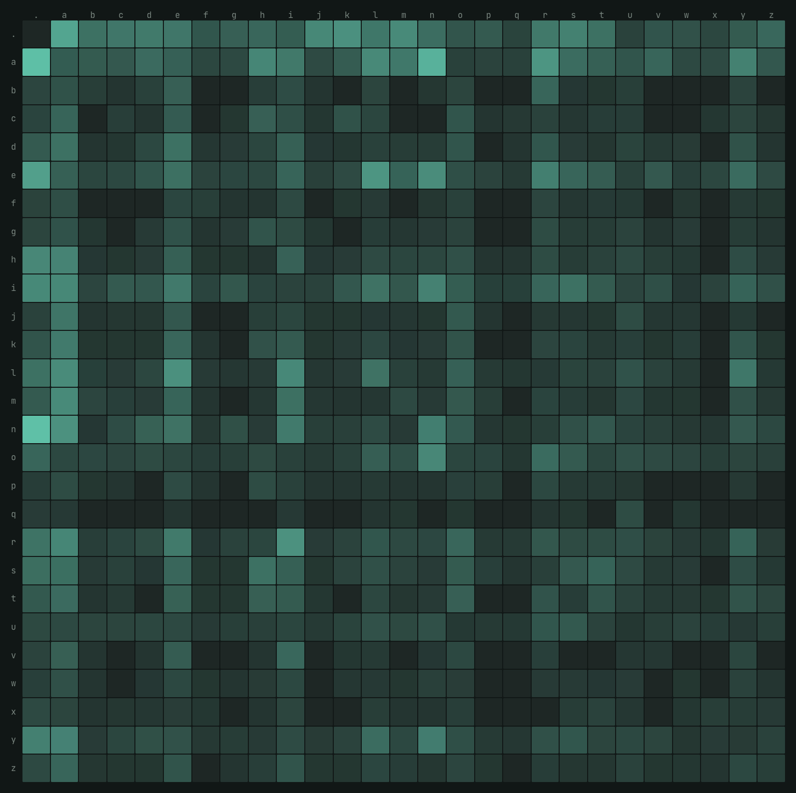

# nn zero to hero系列 - Bigram 模型的两种实现

> **Neural Networks: Zero to Hero · Lecture 2 / makemore part 1**
> 代码：[`makemore_part1_bigrams_exercise.py`](makemore_part1_bigrams_exercise.py) · 数据：32,033 个英文名字 · CPU 单机 < 5 秒

同一个字符级二元语言模型，用「数数」和「梯度下降」各写一遍，最后证明它们学到的是同一张 27×27 的概率表。这是整个课程从统计走向神经网络的那一步。

| 指标 | 数值 | 说明 |
| --- | --- | --- |
| 统计法 loss | **2.4546** | 数出 228,146 个 bigram，加一平滑后按行归一化 |
| 神经网络 loss | **2.4748** | 27×27 权重矩阵，lr=50，梯度下降 100 步 |
| 两者差距 | **0.0202** | 继续训到 200 步收敛至 2.4653，还在缩小 |

---

## 00 · 前言

这是 nn zero to hero 系列的第 2 讲。为了更好地理解这个课程，我在karpathy的课件的基础上增加了一些课后练习[exercise](https://github.com/leiwingqueen/nn-zero-to-hero/tree/master/exercise) (答案在分支 exercise/makemore-part1-bigrams-implment)。如果能够在不看注释的情况下完成，基本可以证明你对课程的理解已经到位。有兴趣的同学也可以clone这个项目进行练习。

PS：学习这个课程更多是为了满足个人的求知欲。当然同时对理解整个LLM的实现原理和机制和上层agent的实现都会有一些帮助。

## 01 · 问题设定：预测下一个字符

`load_words` / `build_vocab`

如何通过一个英文名字的数据集，训练出一个能生成英文名的模型？

数据集是 32,033 个英文名字，最短 2 个字符，最长 15 个。模型只看**前一个字符**来预测下一个字符 —— 这就是 bigram（二元组）假设，也是最弱的一种语言模型。弱有弱的好处：它小到可以完全写在一张 27×27 的表里，因此适合把「训练一个语言模型」这件事的每一环都摊开看清楚。

词表只有 27 个 token：26 个小写字母，加一个特殊符号 `.`。这个点同时充当开始符和结束符，并且必须映射到下标 0。

```python
# '.' 固定占 0 号位，字母按字典序排 1..26
chars = sorted(set(''.join(words)))
stoi = {'.': 0}
for i, char in enumerate(chars):
    stoi[char] = i + 1
```

为什么开始和结束能共用一个符号？因为它们从不出现在同一个位置上：`.` 作为*输入*时表示「句子开头」，作为*输出*时表示「到此结束」。矩阵的第 0 行是起始字符分布，第 0 列是结束字符分布，互不干扰。

> ⚠️ **易错点**
> 如果偷懒写成 `stoi = {s:i for i,s in enumerate(chars)}` 再补 `stoi['.']=26`，后面所有断言都会挂 —— 课程里的可视化、以及「采样遇到 0 就停」的约定都默认了 `.` 在 0 号位。

---

## 02 · 数出来的模型：计数矩阵 N

整体思路很简单，我们统计每个相邻的字符对，然后可以根据这个数据计算下一个字符分别出现的概率。

`count_bigrams` · 228,146 个样本

给每个名字前后补上 `.`，然后用 `zip(chs, chs[1:])` 滑窗取出所有相邻字符对，往 `N[i][j]` 上加一。32,033 个名字一共产出 228,146 个 bigram，填满这张 27×27 的表：



*行 = 当前字符，列 = 下一个字符；颜色按 √ 缩放，最亮的格子是 `n.` 的 6,763 次，最暗的是计数为 0 的组合。*

第一行是「名字用什么开头」，第一列是「名字用什么结尾」。左上角 `N[0,0]=0` —— 没有空名字。729 个格子里有 **102 个是 0**，全部集中在辅音-辅音这类组合上。

排在最前面的几个 bigram 一眼就能看出英文名字的构词习惯：

| Bigram | 计数 | 读法 |
| --- | ---: | --- |
| `n .` | 6,763 | 以 n 结尾（Ethan、Logan、Mason） |
| `a .` | 6,640 | 以 a 结尾（Emma、Olivia、Sophia） |
| `a n` | 5,438 | -an- 组合 |
| `. a` | 4,410 | 以 a 开头 |
| `e .` | 3,983 | 以 e 结尾 |
| `a r` | 3,264 | -ar- |

---

## 03 · 归一化，和那个著名的广播陷阱

`normalize_counts`

把计数变概率只需要一行：每行除以该行的和。但这一行是整节课踩坑最多的地方。

```python
P = (N + smoothing).float()
P = P / P.sum(1, keepdim=True)   # (27,27) / (27,1)  ✅ 按行对齐
# P = P / P.sum(1)               # (27,27) / (27,)   ❌ 被当成 (1,27)，按列对齐
```

PyTorch 广播时会在形状左侧补 1。`(27,)` 会变成 `(1,27)` 然后沿*行*方向复制，于是你用「每行的和」去除了「每一列」—— 结果矩阵每行加起来不等于 1，**而且不报错**。写 `keepdim=True` 得到 `(27,1)`，才是按行复制。

`smoothing` 是加法平滑（拉普拉斯平滑）：先给每个格子加个常数再归一化，把 0 概率抬到一个很小的正数。它的作用是防止模型在遇到训练集里没见过的字符对时给出 `-inf`。

| smoothing | 训练集 loss | 效果 |
| --- | ---: | --- |
| 0 | 2.4540 | 最贴合数据，但对未见过的 bigram 给出 −∞ |
| 1 | 2.4546 | 默认值，代价几乎为零 |
| 10 | 2.4621 | 开始变平 |
| 100 | 2.5375 | 明显欠拟合，趋向均匀分布 |

> ⚠️ **容易误解的一点**
> `smoothing=0` 在训练集上算 loss 并*不会*真的出现 −∞ —— 因为训练集里出现过的 bigram 计数天然 ≥ 1。−∞ 只在你拿这个 P 去评估新数据、或者反过来问「`jq` 这个组合概率多少」时才炸。这也是为什么平滑属于**泛化手段**而不是数值技巧。

---

## 04 · 用什么衡量好坏：平均负对数似然(Average Negative Log-Likelihood)

`nll_loss_from_P`

训练目标的推导链条很短，但每一步都值得说清楚：

```text
最大化 似然       ∏ P[i,j]         # 连乘，很快下溢到 0
最大化 对数似然   Σ log P[i,j]     # log 单调递增，等价；连乘变连加
最小化 负对数似然 −Σ log P[i,j]    # 习惯上把「越小越好」作为 loss
最小化 平均 NLL   −Σ log P[i,j]/n  # 除以样本数，与数据集大小无关
```

取 log 不只是为了数学方便：228,146 个小于 1 的数连乘，float32 早就变成 0 了。

三个数字放在一起才有意义：

| 模型 | 平均 NLL | 困惑度 e^NLL | 含义 |
| --- | ---: | ---: | --- |
| 均匀分布（瞎猜） | 3.2958 | 27.0 | 每步都在 27 个字符里等概率乱选 |
| Bigram 统计法 | 2.4546 | 11.6 | 每步的有效候选缩小到约 12 个 |
| Bigram 神经网络 | 2.4748 | 11.9 | 100 步后尚未完全收敛 |

`ln 27 = 3.2958` 是这个词表下的天花板，任何有意义的模型都必须低于它。bigram 只把困惑度从 27 降到 11.6 —— 采样出来的名字仍然是「像名字的乱码」。后面几节课把上下文从 1 个字符扩到 3 个、再到 Transformer，本质上就是在继续压这个数。

---

## 05 · 训出来的模型：一层线性网络

`build_dataset` / `forward` / `train`

同一个模型换个写法：不再数数，而是维护一个 27×27 的可训练矩阵 `W`，让梯度下降自己找到它。前向传播四步：

```python
xenc   = F.one_hot(xs, num_classes=27).float()  # (N,27) 必须转 float 才能做矩阵乘
logits = xenc @ W                               # 解释成 log-counts
counts = logits.exp()                           # 变回正数，等价于计数
probs  = counts / counts.sum(1, keepdim=True)   # 按行归一化
```

后两步合起来就是 softmax。这里同样要 `keepdim=True` —— 和第 03 节是同一个坑。

训练循环里有三个看起来奇怪、但都有理由的选择：

| 写法 | 为什么 |
| --- | --- |
| `lr = 50` | 这个 loss 面极其平缓，且是凸的（单层 + softmax + 交叉熵），不存在震荡出去的风险。用 0.1 要跑几万步 |
| `W.grad = None` | PyTorch 梯度是累加的，不清零会把上一步的梯度加进来。置 `None` 比置 0 稍快 |
| `W.data += ...` | 绕开 autograd 直接改数值。等价于 `with torch.no_grad():`，否则更新本身会被记进计算图 |

实测收敛过程（整个数据集当一个 batch，200 步在 CPU 上只要 1.3 秒）：

| 步数 | 1 | 2 | 5 | 10 | 20 | 50 | 100 | 150 | 200 |
| --- | ---: | ---: | ---: | ---: | ---: | ---: | ---: | ---: | ---: |
| NLL | 3.7590 | 3.3701 | 2.9264 | 2.7105 | 2.5792 | 2.4984 | **2.4750** | 2.4683 | 2.4653 |

**前 20 步就吃掉了 80% 的下降空间**，之后进入长尾。练习里跑 100 步（2.4750）主要是为了让 loss 和统计法「接近但不完全相等」，说明它确实是逼近而不是抄答案。

---

## 06 · 为什么两条路殊途同归

> 💡 **一句话**
> one-hot 向量乘矩阵，等于**取出矩阵的第 ix 行**。所以这个「神经网络」根本没在做矩阵乘法，它做的是查表 —— 和统计法查 `P[ix]` 是同一个动作。

把两边并排写，对应关系就完全暴露了：

| 环节 | 统计法 | 神经网络 |
| --- | --- | --- |
| 取出这一行 | `N[ix]` | `one_hot(ix) @ W` |
| 保证为正 | 计数天然 ≥ 0 | `.exp()` |
| 归一化 | `/ sum(1, keepdim)` | `/ sum(1, keepdim)` |
| 防止 0 概率 | 加法平滑 `N+1` | L2 正则 `reg*(W**2).mean()` |

关键在于 `logits = xenc @ W` 被解释为 **log-counts**：如果令 `W = log(N)`，那么 `exp(logits)` 就精确等于计数矩阵，归一化后得到的正是统计法的 P。也就是说统计法给出的是这个优化问题的*解析解*，而梯度下降是在数值上朝它逼近。两者 loss 的 0.02 差距，就是「还没走到」的距离。

### 正则项 = 平滑，这不是类比

L2 正则把 W 往 0 拉。W 越接近 0，`logits` 越平坦，`exp` 之后各项越接近，概率分布越趋向均匀 —— 效果和给计数矩阵每格加常数完全一致。把 `reg` 调大，就相当于把 `smoothing` 调大；调到极端，两边都会退化成均匀分布（loss 回到 3.2958）。同一个正则化思想，在两套语言里长成了两副样子。

> 🤔 **那为什么还要用神经网络写法**
> 对 bigram 而言，神经网络版本更慢、更复杂、结果还差一点点 —— 它唯一的优势是**可扩展**。计数法在 trigram 上需要 27³ 个格子，四元组 27⁴，指数爆炸且大部分是 0；而 `forward` + `backward` 这套框架完全不变，换个更大的网络就能处理任意长的上下文。这正是后面几节课要走的路。

---

## 07 · 采样：两个模型说出同样的胡话

`sample_from_P` / `sample_from_W`

从 `ix=0` 出发，用 `torch.multinomial` 按当前行的概率抽下一个字符，抽到 0 就停。两边用同一个种子 `2147483647`：

| # | 统计法 · P | 神经网络 · W |
| ---: | --- | --- |
| 1 | `cexze` | `cexze` |
| 2 | `momasurailezity`**`nn`** | `momasurailezity`**`ha`** |
| 3 | `konimittain` | `konimittain` |
| 4 | `llayn` | `llayn` |
| 5 | `ka` | `ka` |

五个名字里四个逐字符相同，第二个在第 16 位分叉。这不是 bug：两张概率表最大单点差异是 **0.078**（集中在样本极少的行上），只要某一步的累积概率恰好落在差异区间里，`multinomial` 就会选出不同字符，此后随机数流错位，后缀彻底不同。**前 15 个字符完全一致，恰恰是两个模型等价的最直观证据。**

> 🔧 **实现细节**
> `generator` 必须在循环*外*创建一次，5 个名字共用一条随机数流；放进循环里每次都 reseed，会得到 5 个一模一样的名字。另外 `sample_from_W` 里可以先把 27 行的 P 一次性算完再采样，不必每步都做一次 one-hot 矩阵乘。

---

## 08 · 复现与自检

```bash
git clone git@github.com:leiwingqueen/nn-zero-to-hero.git   # names.txt 已包含在 exercise/ 下
cd nn-zero-to-hero
python exercise/makemore_part1_bigrams_exercise.py
```

脚本逐节断言，任何一环写错都会在对应的检查点停下：

| 检查点 | 内容 |
| --- | --- |
| `1/6` **字符表** | `len(stoi)==27`、`stoi['.']==0`、`itos[26]=='z'` |
| `2/6` **计数** | `N.shape==(27,27)`、`N[0,0]==0`、`N[0,'a']==4410`（4,410 个名字以 a 开头） |
| `3/6` **概率与 loss** | 每行和为 1，loss ≈ 2.4544。这里挂了八成是 `keepdim` 忘了写 |
| `4/6` **统计法采样** | 输出「像名字的乱码」即可；torch 各版本 `multinomial` 实现有差异，不必和视频逐字对齐 |
| `5/6` **网络训练** | 样本数 228,146，100 步后 loss < 2.50 |
| `6/6` **网络采样** | 应与 `4/6` 的结果高度一致，这是全篇的收尾结论 |

### 如果想继续往下挖

三个成本很低、收益很高的延伸实验：

1. 把 `steps` 提到 2000，看 loss 能否压到 2.4546 以下（会略低于统计法，因为正则强度和平滑强度并不严格相等）；
2. 把 `reg` 设为 0，再看采样结果；
3. 最有价值的一个 —— 改成 **trigram**（用两个字符预测第三个），亲手感受一下计数法的 27³ 稀疏问题，这正是下一节 MLP 要解决的东西。

---

*数据 32,033 names / 228,146 bigrams · torch CPU · seed 2147483647*
*原课程：[karpathy/nn-zero-to-hero](https://github.com/karpathy/nn-zero-to-hero) · Lecture 2 · The spelled-out intro to language modeling*
