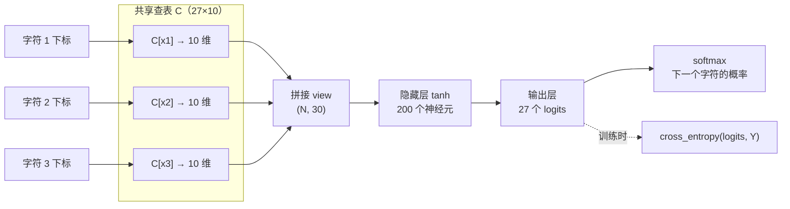
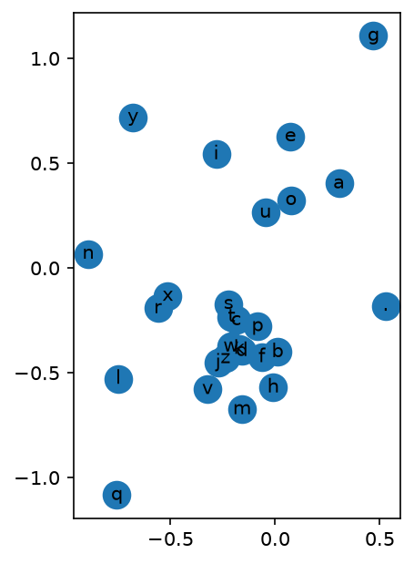

# 从 Bigram 到 MLP：makemore part2 实验复盘

2026-09-26 · leiwingqueen

## 为什么要从 Bigram 走向 MLP

用一个约 3.9 万参数的 MLP，我把名字生成任务的 dev loss 从 bigram 的 2.4544 降到了 2.1021。这篇文章记录 makemore part2 三个 LAB 的实现、调参过程，以及一个中途发现并修复的 batch_size bug。

part1 的 bigram 只看前 1 个字符。想看 3 个字符，计数表就要 27³ = 19,683 行，绝大多数格子的计数是 0，模型无法泛化到没见过的组合。

Bengio et al. 2003 给出的解法是：把每个字符映射成一个低维稠密向量（embedding），把上下文的向量拼起来交给 MLP 预测下一个字符。相似的字符会得到相近的向量，于是可以互相借用统计信息。

本文涉及的文件：

- `makemore_part2_mlp_exercise.py`：基础实现，带逐节断言自检
- `makemore_part2_mlp_exercise_e01.py`：E01 超参调优
- `makemore_part2_mlp_exercise_e04.py`：E04 二维 embedding 可视化
- `mlp.md`：调参记录

## 基础实现

基线配置（block 3、emb 10、hidden 200、10 万步）跑出 train 2.1716、dev 2.2054，比 bigram 低 0.25。

### 数据集：滑动窗口

每个名字从全 `.` 的上下文开始，每读一个字符就记一条样本，再把窗口向右滑一格。以 `emma`、block_size = 3 为例：

| 上下文 | X | Y |
| --- | --- | --- |
| `...` | [0, 0, 0] | e (5) |
| `..e` | [0, 0, 5] | m (13) |
| `.em` | [0, 5, 13] | m (13) |
| `emm` | [5, 13, 13] | a (1) |
| `mma` | [13, 13, 1] | . (0) |

最后一行预测结束符 `.`，模型靠它学会“何时停下”。数据按名字切成 train / dev / test = 80% / 10% / 10%，共 228,146 条样本。dev 用来调参，test 只在最后看一次。

### 网络结构



3 个上下文字符各自在同一张表 C 里查出 10 维向量，拼成 30 维后经过 tanh 隐藏层，输出 27 个 logits；softmax 之后就是下一个字符的概率分布。

| 步骤 | 操作 | 输出形状 | 参数量 |
| --- | --- | --- | --- |
| 查表 | `C[X]` | (N, 3, 10) | C: 27×10 = 270 |
| 拼接 | `emb.view(N, -1)` | (N, 30) | 0 |
| 隐藏层 | `tanh(x @ W1 + b1)` | (N, 200) | 6,000 + 200 |
| 输出层 | `h @ W2 + b2` | (N, 27) | 5,400 + 27 |

合计 11,897 个参数。前向函数只有几行：

```python
def forward(X, params):
    N = X.shape[0]
    C, W1, b1, W2, b2 = params
    emb = C[X]                                        # (N, 3, 10)
    hidden = torch.tanh(emb.view(N, -1) @ W1 + b1)    # (N, 200)
    logits = hidden @ W2 + b2                         # (N, 27)
    return logits
```

三个细节值得注意：

- `C[X]` 是高级索引，等价于 one-hot @ C，但查表快得多。
- 用 `view` 而不是 `torch.cat`：view 只改 shape 和 stride，不复制内存。
- N 不写死：训练时 32 行、评估时 18 万行共用同一个函数。

### 训练循环

```python
for i in range(steps):
    ix = torch.randint(0, N, (batch_size,), generator=g)
    logit = forward(Xtr[ix], params)
    loss = F.cross_entropy(logit, Ytr[ix])
    for p in params:
        p.grad = None
    loss.backward()
    lr_i = lr if i < decay else lr * decay_factor
    for p in params:
        p.data += -lr_i * p.grad
```

- **minibatch**：梯度不准但便宜，多走步数更划算。
- **F.cross_entropy**：内部先减每行最大值再取 exp，大 logit 不会溢出成 nan，也不分配中间张量。
- **梯度清零**：PyTorch 的梯度会累加，每步都要置 None。
- **学习率衰减**：前 60% 步用 0.1，之后乘以 0.1 精调。

### 学习率搜索

在指数上均匀扫描：`lrs = 10 ** torch.linspace(-3, 0, 1000)`，第 i 步用 `lrs[i]` 更新一次并记录 loss。学习率的影响是乘性的，0.001→0.01 和 0.1→1 是同一量级的差别。

每次扫描都重新初始化一套参数，不污染正式训练。在 block 5、emb 2、hidden 300 的配置下实测，lr 超过约 0.6 后 loss 开始剧烈震荡，所以取 0.1 很安全。

### 基线结果

| 模型 | train loss | dev loss |
| --- | --- | --- |
| part1 bigram | — | 2.4544 |
| MLP 基线（10 万步） | 2.1716 | 2.2054 |

train 和 dev 只差 0.034，说明还在欠拟合，模型有加大的空间。这就是 E01 的出发点。

## E01：调参

目标是 dev loss < 2.17。下表 7 组实验找到的配置是 block 5、emb 20、hidden 300；修复 batch_size 后重跑，dev 降到 2.1021，但出现了明显的过拟合。规则是每次只改一个旋钮，只看 dev。

注意：下表 7 组实验跑的时候有个 bug，调用 `train` 时把 `BLOCK_SIZE` 传给了 `batch_size`，每步实际只用了 3 或 5 条样本。修复后的结果见本节最后。

| # | 改动 | train | dev | gap (dev − train) | 观察 |
| --- | --- | --- | --- | --- | --- |
| 1 | 基线 100k 步 | 2.1716 | 2.2054 | 0.034 | 欠拟合，起点 |
| 2 | 步数 → 200k | 2.1163 | 2.1654 | 0.049 | 两者都降，仍在收敛 |
| 3 | 步数 → 300k | 2.0944 | 2.1520 | 0.058 | dev 只降 0.013，收益变小 |
| 4 | N_EMB 10 → 20 | 2.0482 | 2.1387 | 0.091 | dev 更低，但 gap 明显拉大 |
| 5 | N_HIDDEN 200 → 300 | 2.0144 | 2.1349 | 0.121 | train 最低，过拟合信号最强 |
| 6 | BLOCK_SIZE 3 → 5 | 2.1260 | 2.1966 | 0.071 | train 反升，gap 收窄 |
| 7 | 步数 → 400k（最终） | 2.0905 | **2.1258** | 0.035 | dev 最低 |

改动是累积的：第 4–7 行 N_EMB = 20，第 5–7 行 N_HIDDEN = 300，第 6–7 行 BLOCK_SIZE = 5。

几点观察：

- **加步数的收益递减**。100k→200k dev 降 0.040，200k→300k 只降 0.013。
- **加容量主要压低的是 train**。N_EMB 和 N_HIDDEN 让 train 降了 0.080，但 dev 只降 0.017，gap 从 0.058 拉到 0.121。
- **第 6 组的结论不可靠**。BLOCK_SIZE 改为 5 时 batch 也从 3 变成了 5，“train 反升”不能只归因于上下文长度。

### 修复 batch_size 后重跑

| 配置 | batch | 步数 | train | dev | gap |
| --- | --- | --- | --- | --- | --- |
| 第 7 组（修复前） | 5 | 400k | 2.0905 | 2.1258 | 0.035 |
| 修复后 | 64 | 300k | 1.7103 | **2.1021** | **0.392** |

两次的网络配置相同：block 5、emb 20、hidden 300，共 38,967 个参数。

dev 又降了 0.024，但 train 掉到 1.7103，gap 从 0.035 扩大到 0.392，脚本里 `gap < 0.15` 的断言也没通过。batch 64 跑 30 万步，相当于把训练集过了约 100 遍，模型开始背答案了。

这也说明，修复前 gap 一直很小，很可能是因为 batch 只有 3～5 条，梯度噪声很大，起到了隐式正则的作用，而不是模型真的没过拟合。

## 顺手做了 E02：缩放初始化

缩放初始化后，E01 的首步 loss 是 3.2926，几乎等于随机猜的理论值 −ln(1/27) = 3.2958。不缩放的 E04 脚本，首步 loss 是 23.0577。

```python
W1 = torch.randn(fan_in, n_hidden, generator=g) * (5 / 3) / fan_in ** 0.5
b1 = torch.randn(n_hidden, generator=g) * 0.01
W2 = torch.randn(n_hidden, VOCAB_SIZE, generator=g) * 0.01
b2 = torch.randn(VOCAB_SIZE, generator=g) * 0
```

- **W2 × 0.01、b2 置 0**：logits 初始都接近 0，softmax 接近均匀分布，模型不再“自信地猜错”。
- **W1 × (5/3)/√fan_in**：这是 tanh 的 Kaiming 增益，避免隐藏层一开始就饱和。

这样训练曲线开头就没有那段“曲棍球柄”，不用浪费前几千步去压小 logits。两个数字都来自修复后脚本的实测：E01 用缩放初始化，E04 用课程默认的未缩放初始化。

## E04：网络自己学会了“元音是一类”

把 N_EMB 设为 2 训练后，直接把 embedding 表 C 的 27 行画在平面上，元音 a、e、o、u 聚在了一起，i 也在附近。



- **元音聚在右上**：a、e、o、u 彼此很近，i 稍远一些。它们在预测下一个字符时作用相似。
- **常见辅音挤在中下部**：b、c、d、s、t 等几乎重叠。
- **行为特殊的字符被单独放置**：q 在左下角，结束符 `.` 在右侧，g、y、n 也各自远离主簇。

这些相似性没有人告诉过模型，是它为了降低 loss 自己学出来的。这就是 embedding 能泛化到没见过的上下文的原因。

修复后的 E04 脚本改回了课程默认配置：block 3、hidden 200、batch 32、10 万步，跑出 train 2.2669、dev 2.2703。两维太窄，效果明显不如 emb 10 或 20，所以这个配置只用来做可视化。

## 总结与下一步

dev loss 一路从 2.4544（bigram）降到 2.2054（MLP 基线），再到 2.1021（修复 batch_size 后的最终配置）。但最终配置的 gap 是 0.392，还有不小的改进空间。

- **实现**：embedding 查表、view 拼接、两层 MLP，基线用不到 1.2 万个参数就打败了 bigram。
- **调参**：要盯住 train/dev 的 gap，也要确认每个超参真的传进了训练函数。batch_size 的 bug 让小 batch 的噪声掩盖了过拟合。
- **可视化**：在二维 embedding 里，元音自动聚成一类，字符间的相似性是学出来的。

下一步：

- [x] 修复 batch_size，并用最终配置重跑 E01 和 E04
- [ ] 在 batch 64 下重新调参：减少步数、加 weight decay 或缩小网络，把 gap 压回来
- [ ] E03：试试 Bengio 论文中从输入直连输出的 skip connection
- [ ] 调参完成后，在 test 集上一次性报告最终 loss
- [ ] 进入 part3：激活值、梯度与 BatchNorm

参考：[Bengio et al. 2003, A Neural Probabilistic Language Model](https://www.jmlr.org/papers/volume3/bengio03a/bengio03a.pdf)
